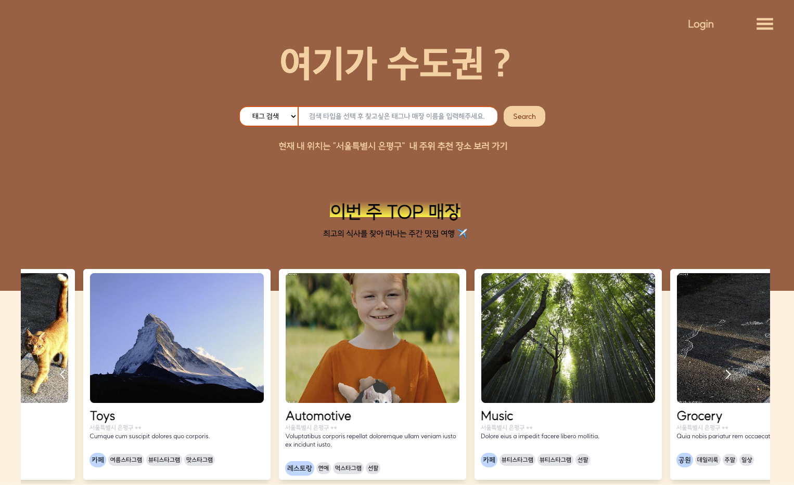

# 🍽️ 맛집 추천 서비스 Komatzip



- 배포 URL : https://komatzip.wo.tc
- Test ID : wkddntjd3429@naver.com
- Test PW : dntjd3429000

## 프로젝트 소개

- Komatzip은 맛집을 좋아하는 사람들이 맛집 정보를 공유하고 소통할 수 있는 웹 플렛폼 입니다.
- 개인의 프로필 페이지에 좋아하는 맛집을 즐겨찾기 하거나, 직접 맛집을 등록 할 수 있습니다.
- 검색을 통해 쉽게 취향의 맛집 및 코스 조회 할 수 있습니다.
- 다양한 맛집 및 코스들을 즐겨찾기 하며, 마음에 드는 게시글에 좋아요를 누르거나 댓글을 작성할 수 있습니다.
- 지도 서비스를 해당 지역의 다양한 맛집 정보를 편리하게 조회 할 수 있습니다.

<br>

## 페이지 및 기능

<br>

| <p align="center">로그인, 회원가입</p>                                                                                                    | <p align="center">메인 페이지</p>                                                                                                         |
| ----------------------------------------------------------------------------------------------------------------------------------------- | ----------------------------------------------------------------------------------------------------------------------------------------- |
| <p align="center"></p> | <p align="center"></p> |

| <p align="center">맵 페이지</p>                                                                                                           | <p align="center">검색 페이지</p>                                                                                                         |
| ----------------------------------------------------------------------------------------------------------------------------------------- | ----------------------------------------------------------------------------------------------------------------------------------------- |
| <p align="center"></p> | <p align="center"></p> |

| <p align="center">마이 페이지</p>                                                                                                        | <p align="center">반응형</p>                                                                                                              |
| ---------------------------------------------------------------------------------------------------------------------------------------- | ----------------------------------------------------------------------------------------------------------------------------------------- |
| <p align="center"></p> | <p align="center"></p> |

## 1. 개발 환경

- Front : React, Typescript, Tailwind, Redux, react-hook-form
- Back-end : Express.js, MongoDB, Filebeat, Redis, Nginx, Docker
- 버전 및 이슈관리 : Github, Github Issues, trello
- 협업 툴 : Discord, Notion, Github,
- 서비스 배포 환경 : vercel,
- 디자인 : [Figma](https://www.figma.com/file/DLWhqJMVQk56i2K5jQy0US/%EC%A7%84%EC%A7%9C-%EC%84%9C%EC%9A%B8%EC%9D%B4-%EC%95%84%EB%8B%88%EB%9D%BC-%ED%95%9C%EA%B5%AD?type=design&node-id=305-509&mode=design&t=e6zp32EFkCtxVtdS-0)
- [커밋 컨벤션](https://github.com/to1step/komatzip-fe/wiki/1.-Commit-Convention)
- [코드 컨벤션](https://github.com/to1step/komatzip-fe/wiki/7.-Code-Convention)

<br>

## 2. 브랜치 전략

- GitHub-Flow 전략을 기반으로 main, develop 브랜치와 feature 보조 브랜치를 운용했습니다.
- main, develop, Feat 브랜치로 나누어 개발을 하였습니다.
  - **main** 브랜치는 배포 단계에서만 사용하는 브랜치입니다.
  - **develop** 브랜치는 개발 단계에서 GitHub-flow의 master 역할을 하는 브랜치입니다.
  - **Feat** 브랜치는 기능 단위로 독립적인 개발 환경을 위하여 사용하고 merge 후 각 브랜치를 삭제해주었습니다.

<br>

## 3. BackEnd Type제공 및 사용 (to1step npm 이용 방법)

### 3-1 Personal access tokens (classic) 토큰 발급

1. Github 로그인
2. `Settings` -> `Developer Settings` 접속하여 `Personal access tokens (classic)` 클릭
3. Generate new token (classic) 을 클릭하여 토큰 생성 페이지 이동
4. read:packages 옵션 활성화

### 3-2 로그인 하기

프로젝트 레포로 이동하여 아래 명령어 실행

```
npm login --registry=https://npm.pkg.github.com
username: 본인 깃허브 이름
password: 발급받은 token
email: 본인 이메일
```

- `npm 9v`을 사용하는 경우 npm login --registry=https://npm.pkg.github.com 뒤에 `--auth-type=legacy` 부분을 추가해야함

<br>

### 4. 환경 변수 설정

```env
    ## 카카오 API 발급
    VITE_REST_API_KEY=
    VITE_JAVASCRIPT_KEY=
    VITE_ADMIN_KEY=
    ## API 주소
    VITE_PUBLIC_API=
```

<br>

### 5. 개발 시작

```bash
    npm install
    npm run dev
```
